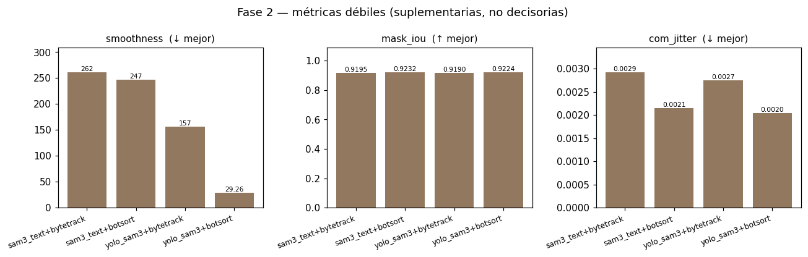

# Proyecto FutBot MX 2026 — UAQ Team

Sistema de **detección, segmentación, seguimiento y análisis** de videos de fútbol
robótico (Copa FutBotMX). El objetivo es tomar un video de un partido y producir, por
cada robot/pelota, **máscaras**, **cajas** y **trayectorias con identidad estable** a lo
largo del tiempo, además de métricas para comparar configuraciones del pipeline.

Este README resume **lo que se ha construido y lo que se tiene hasta ahora**. El detalle
de ingeniería de cada pieza vive en [`CLAUDE.md`](CLAUDE.md) y en `.specs/<tarea>/`
(metodología [Spec-Driven Development](.specs/constitution.md)). Para **usar** el sistema
en tus propios notebooks, abre el **recetario**:
[`notebooks/cookbook_pipeline.ipynb`](notebooks/cookbook_pipeline.ipynb).

---

## Estado actual (qué funciona hoy)

El **pipeline SAM3** está construido y operativo de punta a punta. Hoy puedes, sobre un
video real:

- **Segmentar** cada frame por clase (robots, pelota, etc.) con **SAM3**.
- **Trackear** todo el video asignando `obj_id` **estables y únicos** por objeto.
- Elegir el **detector** y el **tracker** como piezas intercambiables.
- Correr **un video** o **lotes** de videos con una sola llamada.
- Generar **mp4 anotados** y **JSON** auto-descriptivo (con o sin máscaras COCO-RLE).
- **Comparar configuraciones** con un benchmark sin ground-truth (eficiencia +
  consistencia).

Todo es **config-driven** (sin rutas ni parámetros hardcodeados) y `src/` se instala
como **paquete editable** (`import src` funciona desde cualquier notebook).

---

## El sistema en una idea: detector → tracker

El pipeline **compone dos ejes ortogonales**:

```
video ─► [ detector / segmentador ] ─► [ tracker ] ─► mp4 + JSON
              sam3_text | yolo_sam3       none | bytetrack | botsort
```

- **Detector / segmentador** (qué hay en cada frame) —
  [`src/core/detectors/`](src/core/detectors/):
  - `sam3_text` — SAM3 segmenta por *prompt de texto* ("robot", "orange ball").
  - `yolo_sam3` — un **YOLO afinado** (entrenado en los 103 videos NO-testing con
    auto-etiquetas de SAM3) localiza cajas rápido y SAM3 segmenta dentro de ellas.
- **Tracker** (cómo se mantiene la identidad entre frames) —
  [`src/core/trackers/`](src/core/trackers/):
  - `none` (solo segmentación, `obj_id` inestable), `bytetrack` (Kalman + IoU) o
    `botsort` (añade compensación de movimiento de cámara).

Una **única puerta de entrada** ([`run_inference`](src/core/inference.py)) resuelve por
ti el muestreo de frames, el render y el esquema de salida según el modo.

---

## Capacidades, una por una

| Capacidad | Función | Qué hace |
|---|---|---|
| **Inferencia (fachada)** | [`run_inference`](src/core/inference.py) | Punto único por video: `mode="segmentation"` o `"tracking"`. Devuelve `{"json", "video", "index"}`. |
| **Segmentación per-frame** | [`run_pipeline`](src/core/pipeline.py) | Segmenta cada frame con el detector elegido. `obj_id` inestable. |
| **Tracking** | [`track_video`](src/core/tracking.py) | Streaming del video completo + ByteTrack/BoT-SORT → `obj_id` estables. Sin OOM. |
| **Lotes** | [`run_batch`](src/core/batch.py) | N videos (por `split` o lista), SAM3 cargado **una sola vez**, skip-done, aislamiento de errores, resumen con timing. |
| **Overlay por `obj_id`** | [`render_obj_id_overlay`](src/core/track_overlay.py) | Post-pase que dibuja caja + `nombre #id` + trayectoria, sin re-inferir. |
| **Benchmark sin-GT** | [`src/eval/benchmark.py`](src/eval/benchmark.py) | Selección reproducible de videos + métricas de eficiencia/trayectoria/máscara + tabla comparativa. |
| **Dataset** | [`build_metadata_csv`](src/data/metadata.py), [`export_testing_frames`](src/data/eval_frames.py) | Manifiesto con splits reproducibles + congelado del set de evaluación. |

Parámetros transversales útiles (en `run_inference`/`run_batch`):

- `detector` / `tracker` — eligen las piezas del pipeline.
- `include_masks` — embebe máscaras COCO-RLE en el JSON.
- `run_label` — **namespacea las salidas por config** (`outputs/inference/<run_label>/…`)
  para que varias configuraciones **no se pisen** (y skip-done por config).
- `progress` — barra de progreso `tqdm` por video (segmentación y tracking).
- `sampling` — `"auto"` deja que el modo decida (segmentación → cuota; tracking →
  prefijo contiguo en streaming).

---

## Benchmark sin ground-truth (dos fases)

Como aún no hay anotación manual, no se mide exactitud (mAP/MOTA/mIoU) sino
**eficiencia y consistencia**. El costo lo domina el detector y el tracker es casi
gratis, así que el benchmark separa los ejes:

- **Fase 1 — detectores**
  ([`01_benchmark_detectors.ipynb`](notebooks/benchmark_models/01_benchmark_detectors.ipynb)):
  `sam3_text` vs `yolo_sam3`, eficiencia (FPS, VRAM).
- **Fase 2 — trackers 2×2**
  ([`02_benchmark_trackers.ipynb`](notebooks/benchmark_models/02_benchmark_trackers.ipynb)):
  detector × tracker, consistencia (`frag_rate`, `tracklet_len`).
- **Fase 3 — análisis**
  ([`03_benchmark_analysis.ipynb`](notebooks/benchmark_models/03_benchmark_analysis.ipynb)):
  gráficas comparativas.

Corre sobre 5 videos de **testing** elegidos con semilla fija. Es **honesto**: YOLO se
entrenó solo con los videos NO-testing, así que el split de testing está intocado para
ambos detectores.

---

## Resultados del benchmark

Corrida sobre 5 videos de testing (seed=36), tracking acotado a 2500 frames. Gráficas
generadas por
[`03_benchmark_analysis.ipynb`](notebooks/benchmark_models/03_benchmark_analysis.ipynb).
**Sin ground-truth: miden eficiencia y consistencia, no exactitud.**

### Fase 1 — eficiencia del detector


| Detector | FPS (↑) | VRAM pico MB (↓) |
|---|---|---|
| `sam3_text` | **1.82** | **2157** |
| `yolo_sam3` | 1.71 | 3151 |

En segmentación pura, `sam3_text` es **ligeramente más rápido y ~1 GB más ligero**:
`yolo_sam3` añade el costo de YOLO **sin** quitarle trabajo a SAM3 (igual segmenta cada
caja). La ventaja de YOLO aparece recién con tracker (Fase 2).

### Fase 2 — trackers (2×2)


| Config | FPS (↑) | VRAM MB (↓) | frag_rate (↓) | tracklet_len (↑) |
|---|---|---|---|---|
| `sam3_text+bytetrack` | 2.15 | **2157** | 0.035 | **192.7** |
| `sam3_text+botsort` | 1.83 | **2157** | 0.061 | 134.5 |
| `yolo_sam3+bytetrack` | **2.25** | 3151 | 0.035 | 186.3 |
| `yolo_sam3+botsort` | 1.95 | 3151 | **0.011** | 146.5 |

### Aislando cada eje


**Lectura:**

- **Eficiencia:** `bytetrack` rinde más que `botsort` (BoT-SORT paga la compensación de
  cámara); en VRAM, `sam3_text` (~2.1 GB) pesa ~1 GB menos que `yolo_sam3` (~3.1 GB). El
  líder de throughput es `yolo_sam3+bytetrack` (2.25 FPS), a costa de más VRAM.
- **Consistencia:** `yolo_sam3+botsort` tiene la **menor fragmentación con diferencia**
  (0.011), pero tracklets más cortos (146) y menos FPS. `sam3_text+bytetrack` da los
  **tracklets más largos** (193) con fragmentación competitiva (0.035) y el menor consumo.
- **Interacción (por eso el 2×2):** BoT-SORT solo ayuda **emparejado con `yolo_sam3`**;
  con `sam3_text` es el **peor** (frag 0.061, tracklet 134). No es separable por ejes.

**Candidatos razonables** según la prioridad: `yolo_sam3+bytetrack` (throughput) o
`yolo_sam3+botsort` (mínima fragmentación); `sam3_text+bytetrack` si se prioriza VRAM y
tracklets largos. La decisión es humana; la exactitud llegará con el ground-truth.

### Métricas débiles (suplementarias, no decisorias)



`mask_iou` ~0.92 en las 4 configs (**apenas discrimina**); `smoothness` y `com_jitter`
están confundidas por el movimiento real del objeto y son *gameables*. Se muestran por
completitud, **no para decidir**. Recuerda que es una muestra de **5 videos** con frames
acotados, y que sin ground-truth todo esto mide **consistencia, no exactitud**.

---

## Lo que falta / en curso

- **Evaluación con ground-truth — PAUSADA.** A la espera de la anotación manual del
  equipo (Roboflow); cuando llegue el COCO ground-truth, se mide mIoU/Boundary
  IoU/Dice contra él. La evaluación de tracking queda diferida.
- **Estrategia de fine-tuning de YOLO — abierta.** `yolo_sam3` ya usa un YOLO afinado
  con auto-etiquetas SAM3; la estrategia definitiva (Roboflow vs. SAM3-assisted) sigue
  por decidir.
- **`bootstrap_data`** — script idempotente para descargar/colocar videos y pesos
  (aún manual).
- **Streaming de segmentación de video completo** — mejora **condicional** de RAM, solo
  si la segmentación `all_frames` se vuelve un entregable (el benchmark no la necesita).

---

## Instalación y entorno

- **Python 3.11** en entorno aislado (venv local o conda `futbot26`).
- **Torch aparte** según el pod:
  - GPU (RTX 5090/Blackwell): `pip install torch torchvision --index-url https://download.pytorch.org/whl/cu128`
  - CPU: `pip install torch torchvision --index-url https://download.pytorch.org/whl/cpu`
- **SAM3** (no está en PyPI): `pip install git+https://github.com/facebookresearch/sam3.git`

```bash
pip install -r requirements.txt   # deps (torch y sam3 van aparte)
pip install -e .                  # src/ como paquete editable -> import src
```

- Config activo: `CONFIG_FILENAME` en `.env`. Las rutas se resuelven con
  [`src.utils.get_abs_path(...)`](src/utils.py) contra la raíz del proyecto — nunca
  hardcodear.
- Datos reales (git-ignored): videos en `data/raw/`, modelo en `assets/sam3/`, pesos
  YOLO en `assets/yolo/best.pt`.
- **Docker (RunPod):** `docker compose --env-file .env -f docker/docker-compose.yml up --build -d`.
- **La inferencia requiere GPU.** Lo que no llama a SAM3 (rutas, conteo de frames,
  selección del dataset, lint) corre en cualquier entorno.

---

## Notebooks

- [`cookbook_pipeline.ipynb`](notebooks/cookbook_pipeline.ipynb) — **recetario de la
  API (empieza aquí)**.
- [`benchmark_models/00_phase2_cost_smoke.ipynb`](notebooks/benchmark_models/00_phase2_cost_smoke.ipynb)
  — smoke de costo (máscaras casi gratis).
- [`benchmark_models/01_benchmark_detectors.ipynb`](notebooks/benchmark_models/01_benchmark_detectors.ipynb)
  — Fase 1: eficiencia de detectores.
- [`benchmark_models/02_benchmark_trackers.ipynb`](notebooks/benchmark_models/02_benchmark_trackers.ipynb)
  — Fase 2: trackers 2×2 (consistencia).
- [`benchmark_models/03_benchmark_analysis.ipynb`](notebooks/benchmark_models/03_benchmark_analysis.ipynb)
  — Fase 3: gráficas de análisis.
- [`fase_0/`](notebooks/fase_0/) — exploración inicial (spikes SAM3).

> **Antes de escribir un notebook nuevo, revisa el
> [recetario](notebooks/cookbook_pipeline.ipynb)**: casi todo lo útil ya está
> empaquetado en `src/` y documentado ahí, para no rehacer cosas desde cero.

---

## Metodología (SDD)

El repo sigue **Spec-Driven Development** ([`.specs/constitution.md`](.specs/constitution.md)):
por cada tarea atómica se escribe `spec.md → plan.md → tasks.md` **antes** de tocar
código. El trabajo y los documentos están en español. Lint/formato: `ruff check .` /
`black .`.

---

## Estructura del repo

```
src/core/    inferencia: frame_extraction, sam3_loader, segmentation, detectors/,
             trackers/, overlay, video_writer, pipeline, tracking, inference (fachada),
             batch, track_overlay, inference_schema
src/data/    preparación del dataset: metadata, eval_frames
src/eval/    benchmark sin-GT: benchmark.py
configs/     {NN}_{EXP}.json (rutas relativas + parámetros)
data/raw/    videos .MOV (git-ignored)
assets/      sam3/ + yolo/ (git-ignored) + db_metadata.csv, testing_frames.csv
notebooks/   recetario + benchmark + exploración
testing/     scripts manuales (no pytest)
.specs/      Spec-Driven Development (una carpeta por tarea)
```
