# FutBot MX 2026 — UAQ Team

**Sistema de Detección, Segmentación, Seguimiento y Análisis de Eventos** para partidos de fútbol robótico (Copa FutBotMX - Categoría Profesional).

Este sistema procesa videos en crudo para extraer métricas deportivas y generar visualizaciones analíticas. A partir del flujo de video original, nuestra arquitectura ejecuta un _pipeline_ automatizado que proporciona:

- **Inferencia de Visión:** Extracción de máscaras de segmentación y _bounding boxes_ para cada robot, portería, cancha y balón.
- **Seguimiento Multi-Objeto (MOT):** Construcción de trayectorias espacio-temporales manteniendo identidades estables frente a oclusiones.
- **Mapeo a Coordenadas Métricas:** Transformación geométrica desde la perspectiva de cámara superior hacia un plano bidimensional métrico (cm) del campo de juego.
- **Detección Algorítmica de Eventos:** Evaluación de la telemetría para identificar goles, calcular tiempos de posesión y detectar faltas o colisiones.
- **Síntesis Narrativa:** Composición final de un video analítico enriquecido con telemetría sobrepuesta, diseñado tanto para el espectador como para evaluación técnica.

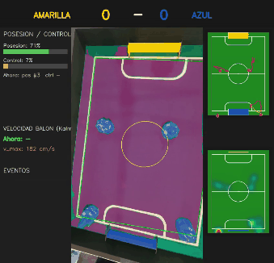

> Documentación de ingeniería por fases en [`docs/`](docs/README.md) y por tarea en
> `.specs/<tarea>/`. Para **usar** la API desde tus notebooks, abre el recetario:
> [`notebooks/cookbook_pipeline.ipynb`](notebooks/cookbook_pipeline.ipynb).

---

## 1. Descripción y arquitectura de la solución

El _pipeline_ ha sido diseñado bajo una arquitectura modular desacoplada para optimizar los recursos computacionales y facilitar la experimentación. Se divide en dos capas principales:

1. **Capa A (Percepción - GPU):** Encargada de la visión pura. Ejecuta la detección, segmentación y seguimiento continuo. Independientemente del tipo de clip, genera máscaras precisas y mantiene la identidad de los objetos (`obj_id`) a lo largo del tiempo, serializando los resultados geométricos dentro de un archivo JSON.
2. **Capa B (Análisis Métrico - CPU):** Encargada de la telemetría y reglas del juego. Lee el archivo JSON de tracking emitido por la Capa A. Al procesar tomas de cámara superior, aplica transformaciones geométricas para proyectar el juego a una escala de centímetros reales, evaluando eventos y métricas de forma inmediata y sin requerir re-inferencia de modelos pesados.

### Enfoque técnico e innovación

**1) Pipeline de Segmentación Zero-Shot a Fine-Tuned (SAM 3 + YOLO)**

Para la etapa de detección y segmentación, se implementó una arquitectura de dos etapas que extiende la capacidad del modelo base mediante la automatización de etiquetas:

- **Generación de Auto-etiquetas (Zero-shot):** Inicialmente, se implementó `sam3_text` aprovechando su capacidad de segmentación por lenguaje natural (_text-prompts_ como "robot", "orange ball") para procesar un corpus de entrenamiento (103 videos excluidos del conjunto de pruebas).
- **Entrenamiento de Detector Específico (YOLO_SAM3):** Utilizando estas auto-etiquetas, se realizó un _fine-tuning_ sobre un modelo YOLO. En el flujo de inferencia, este modelo asume el rol de detector de alta velocidad, generando _bounding boxes_ precisos que alimentan a SAM 3 a manera de _box-prompts_ para extraer la máscara final (`yolo_sam3`).

**2) Tracking con identidad estable.**

El sistema transforma las detecciones aisladas en trayectorias coherentes y persistentes mediante un esquema de _tracking_ algorítmico continuo:

- **Arquitectura de Seguimiento Paralelo:** Se procesa el flujo de video en _streaming_, aplicando algoritmos robustos (**ByteTrack** / **BoT-SORT**) frame a frame.
- **Estabilidad Global:** Al aislar un _tracker_ por cada clase específica, el sistema asegura que cada máscara detectada se asocie correctamente a un historial de movimiento, generando trayectorias (`obj_id`) globalmente únicas y estables para el balón y los robots durante la totalidad del partido.

**3. Mapeo Homográfico al Campo Métrico**

Para traducir el espacio de píxeles a coordenadas físicas espaciales, el sistema estima una homografía por _frame_ que proyecta la imagen hacia el plano cenital oficial del torneo (dimensiones de **243 × 182 cm**, con _inset_ de 12 cm en líneas perimetrales y círculo central de 30 cm de radio).

- **Estimación Robusta (RANSAC):** Extrayendo correspondencias directas entre el mundo físico y la imagen (líneas blancas, esquinas y porterías), se resuelve la matriz homográfica $H \in \mathbb{R}^{3 \times 3}$ mediante mínimos cuadrados robustos.
- **Proyección Geométrica:** La transformación de un punto en píxeles $(u, v)$ a su coordenada métrica se define formalmente como:

$$\begin{bmatrix} x' \\ y' \\ w' \end{bmatrix} = H \cdot \begin{bmatrix} u \\ v \\ 1 \end{bmatrix}$$

Donde las coordenadas finales en centímetros sobre el plano del campo se obtienen mediante la normalización: $(x, y)_{cm} = (x'/w', y'/w')$.

- **Estabilización Temporal:** Para mitigar el _jitter_ o vibración de la cámara entre _frames_, se aplica un suavizado de Media Móvil Exponencial (EMA) sobre la matriz $H$ normalizada ($H_{33} = 1$). Este _pipeline_ consolidado (`homography_multifeature.py`) logra acotar el error de proyección a un rango de **9 a 23 cm**, garantizando alta fidelidad para el cálculo de métricas posteriores.

**4) Cinemática y filtro de Kalman propio (innovación).** La velocidad base es por
**diferencias finitas**, $v = \frac{\|p_t - p_{t-1}\|}{\Delta t}$ con $\Delta t = \frac{f_2 - f_1}{\text{fps}}$, con corte de
outliers y suavizado. Encima corre un **filtro de Kalman de velocidad constante 2D, escrito
desde cero** (estado $x = [p_x, p_y, v_x, v_y]^T$), que aporta velocidad físicamente suave,
**relleno de oclusión** (predict-only) y rechazo robusto de outliers:

- **Predicción:** $x^- = F(\Delta t) x$, $\quad P^- = F P F^T + Q(\Delta t)$
- **Innovación:** $y = z - H x^-$, $\quad S = H P^- H^T + R$
- **Ganancia:** $K = P^- H^T S^{-1}$
- **Corrección:** $x = x^- + K y$, $\quad P = (I - K H) P^-$
- **Oclusión:** $x = x^-$, $\quad P = P^-$ (sin medición; la incertidumbre crece)

con $H = \begin{bmatrix} 1 & 0 & 0 & 0 \\ 0 & 1 & 0 & 0 \end{bmatrix}$, $Q$ derivada de ruido blanco de aceleración ($\sigma_a$),
$R = \sigma_z^2 I$ calibrada del error de homografía ($\sigma_z \approx 15\text{ cm}$), y **gating de Mahalanobis**
$\text{NIS} = y^T S^{-1} y$ contra $\chi^2_2(0.99) = 9.21$ (reemplaza el corte duro de velocidad sin tirar
el track). Esto reduce la **varianza de aceleración un 98–100 %** frente a diferencias
finitas y elimina picos de velocidad imposibles (p. ej. v_max de balón 196.3 → 116.4 cm/s).

**5) Detección algorítmica de eventos.** Sobre las posiciones en cm: **gol estricto** vs tiro (geometría de cruce de línea de portería), **posesión vs control** (proximidad balón-robot con histéresis temporal), **faltas de campo** (fuera, área, _pushing_), zonas (mitades/tercios) y **mapa de calor** de ocupación. El entregable es el **video de espectador** (`event_broadcast_overlay`): marcador, banner de gol, panel de posesión, _feed_ de eventos, minimapa cenital + heatmap y la homografía embebida.

---

## 2. Metodología

### Arquitectura del pipeline (flujo de datos)

```
                         CAPA A (GPU)                         CAPA B (CPU, solo cámara superior)
 video ─► [ detector/segmentador ] ─► [ tracker ] ─► JSON ─► [ homografía ] ─► [ métrica cm ] ─► [ eventos ] ─► broadcast
              sam3_text | yolo_sam3     bytetrack        (líneas→H)      posiciones/velocidad     gol/posesión/    (video
                                        | botsort                        zonas/heatmap/Kalman      faltas          espectador)
```

El diseño del sistema prioriza la mantenibilidad y la escalabilidad mediante un patrón arquitectónico altamente desacoplado:

- **Punto de Entrada Unificado:** El módulo [`run_inference`](src/core/inference.py) estandariza la ingesta de datos, resolviendo el muestreo de _frames_, la renderización y la serialización de salidas, adaptándose dinámicamente al modo de ejecución requerido (`segmentation` o `tracking`).
- **Diseño Intercambiable (Plug-and-Play):** Los módulos de percepción visual y seguimiento espacial son componentes independientes. Alternar entre modelos (ej. de `sam3_text` a `yolo_sam3`, o de `bytetrack` a `botsort`) se gestiona a nivel de configuración en [`src/core/detectors/`](src/core/detectors/) y [`src/core/trackers/`](src/core/trackers/). Escalar el sistema para detectar nuevas clases requiere únicamente ajustar los parámetros de configuración, sin necesidad de refactorizar el código base.
- **Orquestación End-to-End:** El controlador principal [`main.py`](main.py) automatiza el flujo completo, garantizando la transición fluida de la telemetría desde la inferencia en crudo hasta la síntesis del _broadcast_ analítico para el espectador (ver §7).

#### Capa A — percepción (GPU): detección/segmentación → tracking

```
                     run_inference (inference.py) — fachada única por video
                             │  mode = "segmentation" | "tracking"
           ┌─────────────────┴──────────────────┐
           ▼                                     ▼
      pipeline.py                            tracking.py
 (per-frame, obj_id NO estable)        (streaming, obj_id ESTABLE)
           │                                     │
           ▼                                     ▼
 ┌───────────────────┐  get_detector  ┌───────────────────┐  get_tracker ┌──────────────────┐
 │  DETECTOR  ⇆      │ ─────────────▶ │  DETECTOR  ⇆      │ ───────────▶ │  TRACKER  ⇆      │
 │  • sam3_text      │                │  • sam3_text      │              │  • bytetrack     │
 │  • yolo_sam3      │                │  • yolo_sam3      │              │  • botsort       │
 └───────────────────┘                └───────────────────┘              └──────────────────┘
           │                                     │
           ▼                                     ▼
 overlay + mp4 + JSON                 ┌──────────────────────────────┐
 (segmentación)                       │  tracking JSON  ◀── la "moneda"
                                      │  Track / TrackObservation     │   del post-proceso
                                      │  (obj_id estable, [+ máscaras])│
                                      └──────────────────────────────┘
```

**Desacoplamiento Estricto mediante JSON:** El `tracking JSON` representa el único canal de comunicación entre las capas del sistema. Funciona como el formato estándar de intercambio de datos: el post-proceso extrae de ahí las trayectorias (`obj_id` estables y máscaras) sin crear dependencias circulares con los modelos de visión que las originaron.

**Arquitectura de Piezas Intercambiables:** La selección y ejecución de los modelos de visión se realiza mediante funciones de enrutamiento (`get_detector` y `get_tracker`). Este diseño modular permite desmontar e intercambiar cualquier detector o algoritmo de seguimiento directamente desde la configuración, facilitando la escalabilidad del proyecto.

#### Capa B — post-proceso (CPU, cámara superior): homografía → eventos

```
 tracking JSON
      │
      ▼
 ┌────────────────────────────┐  compute_metric_positions(homography="lines" | "masks")
 │  HOMOGRAFÍA  ⇆ (flag)      │
 │  • "lines"  (consolidada)  │  ◀── base compartida del post-proceso
 │  • "masks"  (legacy)       │
 └────────────────────────────┘
      │  xy_cm por frame/obj_id  +  H por frame
 ┌────┼─────────────────┬────────────────────┬───────────────┐
 ▼    ▼                 ▼                    ▼               ▼
 ESTIMADOR DE        zonas               EVENTOS           heatmap
 ESTADO/CINEMÁTICA  (mitades/tercios)   • shot_vs_goal    (ocupación cm)
 • dif. finitas (T4)                    • goal_geometric
 • Kalman CV (f6) ✔                     • possession
   suaviza + oclusión                   • field_violations
      └─────────────────┬────────────────────┘
                        ▼
            event_broadcast_overlay  ◀── EL ENTREGABLE
            (marcador, banner de gol, posesión,
             minimapa cenital, heatmap, homografía embebida)
```

**De Píxeles a Telemetría:** El archivo `tracking JSON` se procesa mediante una base compartida que calcula la homografía (configurable entre `"lines"` o `"masks"`). Esta etapa traduce las cajas de los objetos a posiciones exactas en centímetros (`xy_cm`) para cada _frame_.

**Análisis Multidimensional:** Las posiciones físicas en centímetros se distribuyen simultáneamente a distintos motores lógicos:

- **Física y Estado:** Un Filtro de Kalman suaviza el movimiento y resuelve oclusiones.
- **Lógica Deportiva:** Evaluadores algorítmicos detectan goles, analizan tiempos de posesión y segmentan ocupación zonal.
- **Distribución Espacial:** Generación de _heatmaps_ dinámicos basados en ocupación centimétrica.

**Renderizado del Espectador:** Toda la lógica converge en el módulo `event_broadcast_overlay`. Este _script_ genera el entregable definitivo: compone la vista original superpuesta con telemetría en tiempo real, minimapas cenitales, _banners_ de goles y marcadores de posesión.

### Metodología de desarrollo — Spec-Driven Development (SDD)

Para garantizar la mantenibilidad, escalabilidad y trazabilidad del código, el proyecto se desarrolló bajo el paradigma **Spec-Driven Development (SDD)** (reglas detalladas en [`.specs/constitution.md`](.specs/constitution.md)).

- **Planificación Atómica:** El flujo de trabajo prohíbe la escritura de código sin diseño previo. Por cada tarea o _feature_, se redacta la secuencia `spec.md → plan.md → tasks.md`. Cada requerimiento se aísla en su propio directorio dentro de `.specs/<tarea>/`.
- **Calidad y Estilo de Código:** La base de código cuenta con integración de _linters_ y formateadores estrictos. Se utiliza `ruff check .` y `black .` para garantizar un código limpio, legible y estandarizado.
- **Documentación Centralizada:** La totalidad del código, _commits_ y documentación técnica están redactados en **español**. La arquitectura detallada y el registro por fases del sistema se encuentran disponibles en el directorio [`docs/`](docs/README.md).

---

## 3. Resultados obtenidos y métricas

### 3.1 Demostración visual — pipeline base (cualquier clip)

Detección + segmentación por clase y tracking con identidad estable, sobre clips genéricos
(< 1 min, no cámara superior):

| Segmentación (SAM 3)                                                           | Tracking `obj_id`                                                       |
| ------------------------------------------------------------------------------ | ----------------------------------------------------------------------- |
| 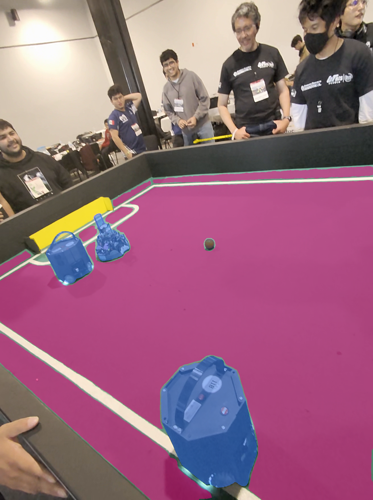 |  |

### 3.2 Análisis avanzado — cámara superior (el entregable)

Video narrativo, mapas de calor dinámicos, posesión con métricas temporales y posiciones en
cm. Ejemplos sobre dos partidos distintos (`IMG_9933`, `IMG_9938`):

| Broadcast (espectador)                                      | Mapa de calor (ocupación)                                    | Zonas / presencia                                           |
| ----------------------------------------------------------- | ------------------------------------------------------------ | ----------------------------------------------------------- |
| 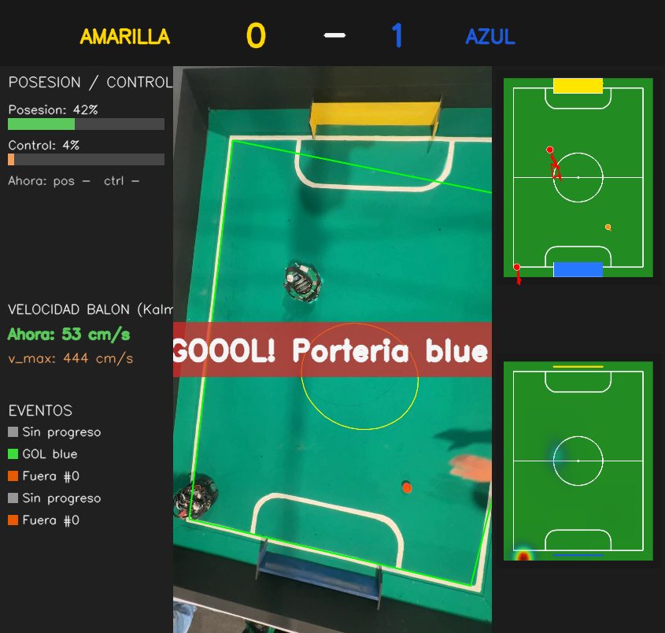 | 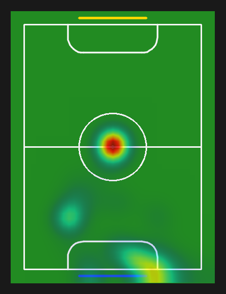 | 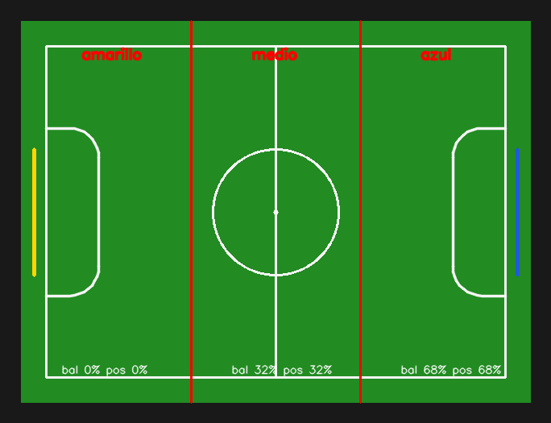 |

**Velocidad: crudo vs Kalman** (suavizado físico + relleno de oclusión):

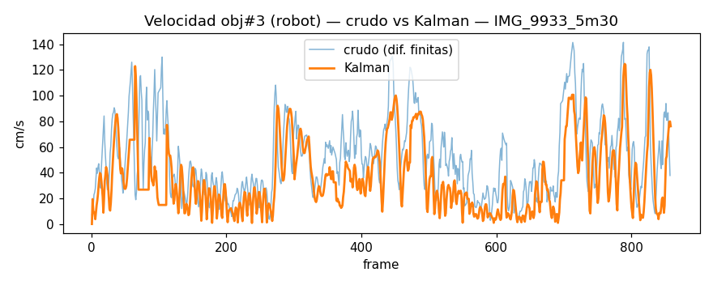

Tablas Kalman completas en [`assets/fase6/tables/`](assets/fase6/tables/): la varianza de
aceleración baja **98–100 %** y se rellenan los huecos de oclusión sin falsos goles.

### 3.3 Desempeño cuantitativo — benchmark sin ground-truth

Ante la ausencia actual de un conjunto de datos etiquetado manualmente, la evaluación no reporta métricas supervisadas tradicionales (como mAP, MOTA o mIoU). En su lugar, el _benchmark_ evalúa rigurosamente la **eficiencia computacional y la consistencia espacio-temporal**.

- **Configuración del Experimento:** La evaluación de rendimiento se ejecuta sobre un _split_ de prueba aislado compuesto por 5 videos (`seed=36`), con el rastreo acotado a 2,500 _frames_ continuos. Los _scripts_ de ejecución y análisis se encuentran disponibles en [`notebooks/fase_3_benchmark_models/`](notebooks/fase_3_benchmark_models/).
- **Prevención de Fuga de Datos (Data Leakage):** Para garantizar la validez metodológica del _benchmark_, el conjunto de validación se mantuvo estrictamente separado. El _fine-tuning_ del modelo YOLO se realizó de forma exclusiva sobre un subconjunto de entrenamiento disjunto (103 videos). Esto asegura una evaluación imparcial (_zero-data contamination_) en el entorno de pruebas para todas las arquitecturas.

**Fase 1 — eficiencia del detector**

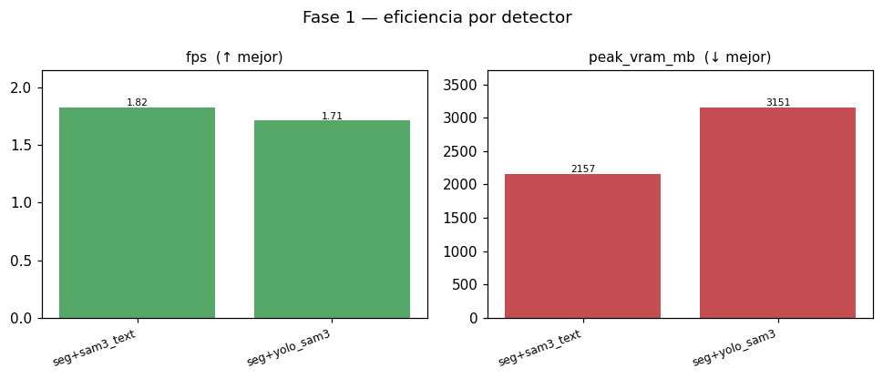

| Detector    | FPS (↑)  | VRAM pico MB (↓) |
| ----------- | -------- | ---------------- |
| `sam3_text` | **1.82** | **2157**         |
| `yolo_sam3` | 1.71     | 3151             |

**Fase 2 — trackers (2×2)**

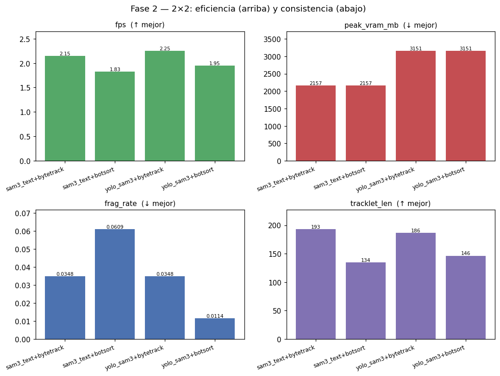

| Config                | FPS (↑)  | VRAM MB (↓) | frag_rate (↓) | tracklet_len (↑) |
| --------------------- | -------- | ----------- | ------------- | ---------------- |
| `sam3_text+bytetrack` | 2.15     | **2157**    | 0.035         | **192.7**        |
| `sam3_text+botsort`   | 1.83     | **2157**    | 0.061         | 134.5            |
| `yolo_sam3+bytetrack` | **2.25** | 3151        | 0.035         | 186.3            |
| `yolo_sam3+botsort`   | 1.95     | 3151        | **0.011**     | 146.5            |

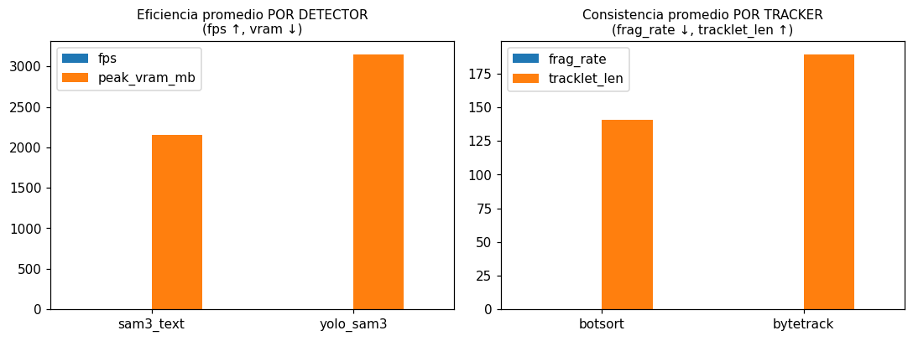

`bytetrack` rinde más que `botsort` (que paga la compensación de cámara); `yolo_sam3+botsort`
tiene la **menor fragmentación** (0.011) y `sam3_text+bytetrack` los **tracklets más largos**
(193) con el menor consumo. BoT-SORT solo ayuda emparejado con `yolo_sam3` (interacción → por
eso el 2×2). `mask_iou` ~0.92 en las 4 configs **apenas discrimina**
([métricas débiles](assets/benchmark/fase2_metricas_debiles.png), suplementarias). La
exactitud llegará con el ground-truth (ver §«Lo que falta»).

---

## 4. Material audiovisual

- 🎥 **Video demo (máx. 2 min):** _[enlace pendiente]_ — muestra la vista original junto al
  resultado segmentado/narrativo (el broadcast superpone segmentación, tracking y
  analítica con explicación visual).
- 📱 **Reel de Instagram (≥ 30 s):** _[enlace pendiente]_

---

## 5. Requisitos de hardware y software

**Hardware.** Los requisitos no se declaran a ojo: se derivan de lo que exige el código y
de lo que se midió al correrlo.

- **Lo que exige el código:** SAM 3 carga en CUDA si está disponible y **cae a CPU** en
  automático ([`sam3_loader.py`](src/core/sam3_loader.py)), así que la GPU no es un
  requisito *duro* sino **práctico**: en CPU la inferencia (Capa A) es inviable por tiempo.
- **Consumo medido:** el pico de VRAM está instrumentado por video
  (`torch.cuda.max_memory_allocated`, [`batch.py`](src/core/batch.py)) y quedó registrado
  en el benchmark — **~2.1 GB** (`sam3_text`) y **~3.1 GB** (`yolo_sam3`), ver
  [`detectors.csv`](outputs/benchmark/detectors.csv). De ahí la recomendación de **GPU
  NVIDIA con ≥4 GB** (pico medido + margen). El pico lo domina el modelo en `bfloat16`, no
  la resolución del clip, por eso es estable entre videos.
- **Validado en:** **RTX 5090 / Blackwell** (banco de pruebas; es un "probado en", no un
  mínimo certificado — no incluye overhead de SO/display ni GPU compartida).
- **Post-proceso (Capa B):** homografía, métrica, eventos y broadcast **no llaman a SAM 3
  ni a CUDA** — corren **solo en CPU** y se reproducen en cualquier laptop a partir de un
  tracking JSON, **sin GPU**.

**Software**

- **Python 3.11**, PyTorch (CUDA cu128 o CPU), **SAM 3** (Meta), HF Transformers, OpenCV,
  `supervision`/`trackers` (ByteTrack/BoT-SORT), Ultralytics YOLO, `questionary` + `rich`
  (consola del hub). Lista completa en [`requirements.txt`](requirements.txt).

---

## 6. Instalación y reproducción

Hay **dos modos** equivalentes; ambos leen los mismos insumos y el mismo config.
Elige **Local** para desarrollo con control fino, o **Docker/RunPod** para una
reproducción aislada en el pod GPU.

### Modo A — Local (venv o conda `futbot26`, Python 3.11)

```bash
git clone <url_del_repositorio>
cd futbot

# Entorno aislado, Python 3.11. Torch va aparte según el destino:
#   GPU (Blackwell): pip install torch torchvision --index-url https://download.pytorch.org/whl/cu128
#   CPU:             pip install torch torchvision --index-url https://download.pytorch.org/whl/cpu
pip install -r requirements.txt
pip install -e .                                                # src/ como paquete editable
pip install git+https://github.com/facebookresearch/sam3.git   # SAM 3 — solo para inferencia desde cero (GPU)

# 1) Provee los insumos del demo (idempotente; elige "Solo demos": clips + JSON con rle + pesos).
#    También genera el .env desde .env.example si falta.
python -m src.bootstrap_data

# 2) Corre el demo guiado: elige el clip; la Capa B (eventos/broadcast/overlays) corre sin GPU.
python main.py --demo
```

> Para el **demo** no hace falta GPU ni SAM 3: el paquete trae el tracking JSON (con
> `rle`) y la Capa B se calcula en CPU. SAM 3 + GPU solo se necesitan para rehacer la
> inferencia desde cero (`--overwrite`).

### Modo B — Docker / RunPod

`pip install -e .` ya se ejecuta en el build, así que **no hay pasos manuales** dentro
del contenedor. El único volumen es el bind-mount del workspace (`../` →
`/${CONTAINER_WORKSPACE_DIR}`): `data/raw` y `assets/sam3` son archivos reales del repo
(sin volúmenes de datos aparte ni symlinks). Un [`.dockerignore`](.dockerignore) excluye
los datos pesados (`data/`, `outputs/`, `assets/sam3`, `assets/yolo`) del contexto de
build —llegan por el bind-mount en runtime—, manteniendo la imagen liviana.

```bash
# Construir y levantar (servicio: futbotmx26)
docker compose --env-file .env -f docker/docker-compose.yml up --build -d

# 1) Provee el demo dentro del contenedor
docker compose --env-file .env -f docker/docker-compose.yml \
  exec futbotmx26 python -m src.bootstrap_data

# 2) Corre el demo guiado dentro del contenedor
docker compose --env-file .env -f docker/docker-compose.yml \
  exec futbotmx26 python main.py --demo
```

**Configuración (ambos modos):** el config activo se elige con `CONFIG_FILENAME` en `.env`
(`configs/01_yolo_sam3_config.json`). Las rutas se resuelven con
[`src.utils.get_abs_path`](src/utils.py) contra la raíz — nunca se hardcodean.

**Insumos no versionados requeridos** (git-ignored):

| Insumo                        | Ruta (config)         | Para qué                    |
| ----------------------------- | --------------------- | --------------------------- |
| Videos `.MOV`                 | `data/raw/`           | dataset                     |
| Modelo SAM 3 (`sam3.pt` + HF) | `assets/sam3/`        | segmentación                |
| YOLO afinado `best.pt`        | `assets/yolo/best.pt` | detector `yolo_sam3`        |
| `.env`                        | raíz                  | `CONFIG_FILENAME`           |

> La inferencia requiere GPU. Todo lo que no llama a SAM 3 (rutas, conteo de frames,
> selección del dataset, **post-proceso CPU** si hay un tracking JSON) corre en cualquier
> entorno.

### Provisión de datos y reproducibilidad

En vez de colocar los insumos a mano, usa el **bootstrap** (idempotente, descarga de
Google Drive con `gdown`; también **genera el `.env`** desde `.env.example` si falta):

```bash
python -m src.bootstrap_data        # menú: Solo demos (recomendado) · Todos · Salir
```

- **Solo demos** — paquete **autocontenido y reproducible**: los clips demo + **sus JSON
  de tracking (con `rle`)** + pesos SAM 3/YOLO. Con los JSON puedes correr la **Capa B
  (segmentación-overlay + eventos/broadcast) en local sin GPU al instante**.
- **Todos** — dataset completo (123 videos) + pesos. El dataset vive en el Drive público
  de la convocatoria; como `17Abril` (88 videos) excede el tope de `gdown`, esa parte es
  **descarga manual** (el bootstrap verifica presencia e imprime el enlace).

**Validar reproducibilidad de extremo a extremo:** sobre un demo, `main.py … --overwrite`
ignora los artefactos descargados y **rehace todo de cero** (re-corre SAM 3, regenera
overlays y broadcast). Si el resultado coincide con el del paquete demo, queda demostrada
la reproducibilidad:

```bash
python main.py data/raw/demos/IMG_9933_5m30.mp4 --overwrite   # rehace inferencia → eventos → broadcast
```

**Validado en local (conda) y Docker.** El flujo del demo —bootstrap → reuso del
tracking JSON → Capa B (eventos/broadcast/overlays)— se probó de punta a punta en un
entorno conda limpio y dentro del contenedor, **sin GPU** (CPU puro). Notas prácticas:

- El paquete demo corre **sin GPU ni SAM 3**: la Capa B se calcula desde el JSON con `rle`.
- **`--overwrite` desde cero sí requiere GPU + SAM 3** (re-corre la inferencia); en CPU no
  es viable.
- El render del broadcast en **CPU es lento** (~0.8 fps; un clip de 1 min ≈ 30 min). Para
  renders completos usa GPU o clips cortos; el camino normal del demo **reusa** el JSON y
  solo recompone el broadcast.
- En Docker, un [`.dockerignore`](.dockerignore) excluye los datos pesados del contexto de
  build (de ~22 GB a ~52 MB): llegan por el bind-mount en runtime, no horneados en la imagen.

---

## 7. Ejecución del flujo de procesamiento

El punto de entrada es el hub [`main.py`](main.py): corre el pipeline **end-to-end sobre un
video** (solo lo lee; por costo se recomiendan clips < 1 min), es **idempotente** (reusa lo
ya generado sin rehacer la inferencia) y **reporta** dónde quedó cada artefacto.

```bash
# Demo guiada: el primer paso es elegir un clip demo del manifiesto (ignora --default/--vista)
python main.py --demo

# Interactivo sobre un clip propio: pregunta detector / tracker / vista de cámara / overlays
python main.py data/raw/.../clip.mp4

# Sin preguntar (config por defecto = yolo_sam3 + bytetrack)
python main.py data/raw/.../clip.mp4 --default

# Forzar re-correr todo / declarar vista no superior
python main.py data/raw/.../clip.mp4 --default --overwrite
python main.py data/raw/.../clip_lateral.mp4 --vista generica
```

Fijos del entregable (no se preguntan): homografía por líneas, **Kalman ON**, gol estricto,
broadcast layout 2. La salida destacada es el **video de espectador** en
`outputs/eventos/<clip>/<clip>_broadcast.mp4`. Las etapas de homografía/eventos/broadcast
solo corren en **cámara superior** (`--vista superior`, por defecto); en un clip genérico el
hub corre solo el pipeline base.

**Overlays individuales (opcionales).** Si se piden, la inferencia de tracking guarda las
máscaras (RLE) en el JSON, de modo que **una sola pasada de SAM 3** alimenta los dos
overlays: el de **tracking** (`<clip>_obj_id.mp4`, caja + `#id` + estela) y el de
**segmentación** (`<clip>_seg.mp4`, relleno de máscara por clase). El de segmentación se
genera como **post-pase desacoplado sobre el JSON** —sin volver a invocar SAM 3—, así que
recorre el **video completo** (misma duración que el de tracking) y es **regenerable en
local sin GPU** a partir del JSON.

**El hub en acción.** Al terminar reporta dónde quedó cada artefacto sin mover nada. En una
corrida `--default` sobre un clip genérico, los overlays no se solicitan y las etapas de
cámara superior se omiten:


En **modo interactivo** (`python main.py <clip>`, sin `--default`) el hub guía la
elección de piezas paso a paso:

| Detector | Tracker | Vista de cámara |
| -------- | ------- | --------------- |
| 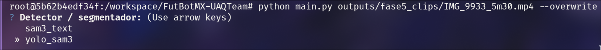 | 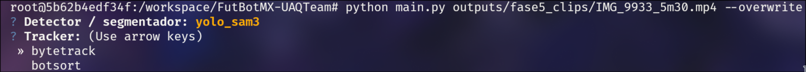 | 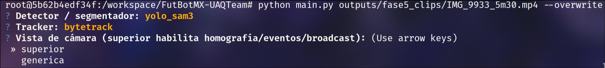 |

Y al terminar reporta dónde quedó cada artefacto (corrida completa con `--overwrite`,
vista superior y overlays: inferencia → overlays → broadcast):

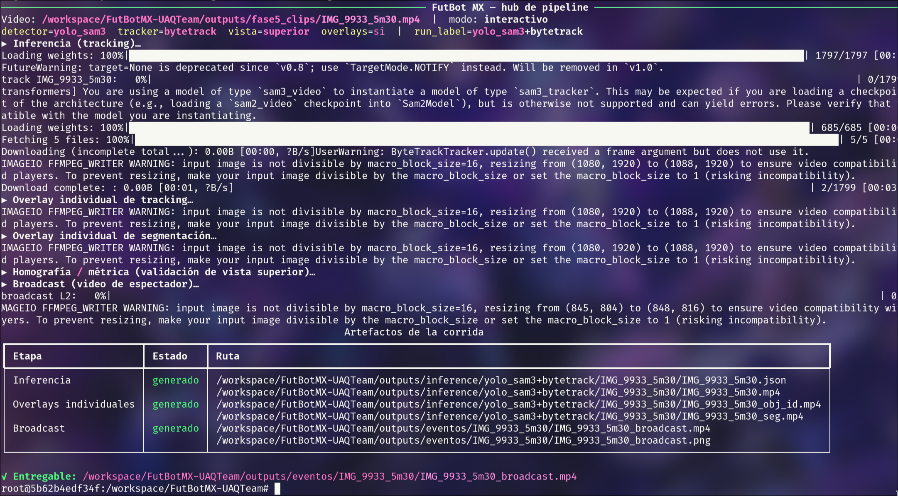

**Regenerar los visuales de este README:**

```bash
# 1) (pod) tracking de los clips curados de cámara superior
python notebooks/fase_5_event_analysis/00_prepare_clips.py
# 2) GIFs/PNGs/gráficas -> assets/readme/  (RUN_HEAVY=1 añade la segmentación SAM 3)
RUN_HEAVY=1 jupyter nbconvert --to notebook --execute --inplace \
  notebooks/fase_7_visuales/00_generar_visuales.ipynb
```

---

## Lo que falta / en curso

- **Evaluación con ground-truth — PAUSADA:** a la espera de la anotación manual del equipo
  (Roboflow). Con el COCO GT se medirá mIoU / Boundary IoU / Dice; la evaluación de tracking
  queda diferida.
- **Estrategia de fine-tuning de YOLO — abierta** (Roboflow vs. SAM3-assisted).
- **`bootstrap_data`** — script idempotente para descargar/colocar videos y pesos (hoy
  manual).

---

## 8. Licencia y créditos

- **Licencia:** [Apache License 2.0](LICENSE).
- **Créditos y atribuciones:**
  - **Meta AI** — [SAM 3](https://github.com/facebookresearch/sam3) (segmentación).
  - **ByteTrack / BoT-SORT** vía `trackers` y **Roboflow Supervision** (asociación y
    utilidades de tracking).
  - **Ultralytics YOLO** (detector afinado), **Hugging Face Transformers** (carga de SAM 3).
  - **Anthropic — Claude (Opus 4.8)** como asistente de programación durante el desarrollo.
  - **UAQ Team — Copa FutBotMX 2026.** Filtro de Kalman, homografía multi-feature, capa
    métrica y overlay narrativo: implementación propia.

---

### Más documentación

- [`docs/README.md`](docs/README.md) — documentación por fases (00 fundamentos … 11 Kalman).
- [`notebooks/cookbook_pipeline.ipynb`](notebooks/cookbook_pipeline.ipynb) — recetario de la API.
- [`CLAUDE.md`](CLAUDE.md) — guía de arquitectura para contribuir.
- [`.specs/`](.specs/) — Spec-Driven Development (una carpeta por tarea).
