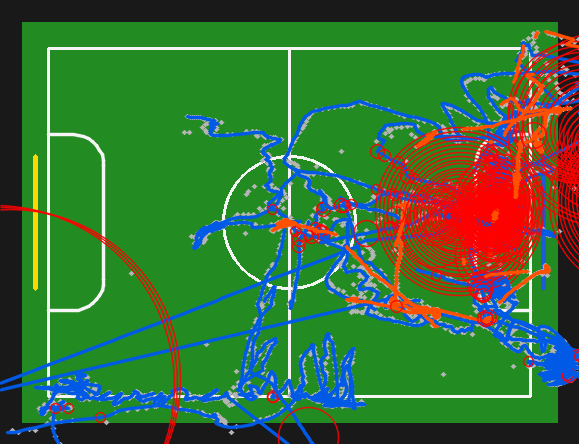

# Fase 6 — Kalman cm-Space State Estimation 🎯

> ## *Estima dónde está el balón aunque no se vea.*
> Filtro de Kalman en **centímetros** sobre la homografía por líneas (nb07): recupera posiciones
> ocluidas, da velocidad **física** en cm/s y una incertidumbre que crece cuando el objeto
> desaparece — sin re-hacer detección ni tracking.

<p align="center">
  
  <br/><em>Trayectoria reconstruida en la cancha 243×182 cm. Los círculos rojos = incertidumbre creciendo donde el objeto está ocluido.</em>
</p>

### En una línea
**Balón ocluido recuperado a ~2.6 cm** (mejor que extrapolación lineal) · velocidad **−99.5%** de
ruido · **352 frames** de oclusión rellenados · y todo **alimenta los eventos sin tocar su código**.

---

## ¿Por qué?

El tracker (ByteTrack/BoT-SORT) ya trae un Kalman interno… pero en **píxeles** y enterrado en la
asociación: su estado nunca se expone y no tiene sentido físico. Y la velocidad de T4 sale de
**diferencias finitas** ruidosas, con un corte duro de 300 cm/s y **huecos** en las oclusiones.

**Fase 6** expone un estimador de estado **interpretable en cm** que arregla las tres cosas:
posición+velocidad principiada, **puenteo de oclusión** (predict-only) y velocidad físicamente suave.

## El modelo (velocidad constante, 2D)

Estado por objeto: `x = [pₓ, p_y, vₓ, v_y]ᵀ` (cm, cm/s).

**Predict** (cada frame, `dt` real):

```
x⁻ = F(dt)·x          P⁻ = F·P·Fᵀ + Q(dt)
```

```
        ⎡1 0 dt 0⎤                  ⎡dt⁴/4   0    dt³/2  0  ⎤
F(dt) = ⎢0 1 0 dt⎥      Q(dt) = σ_a²⎢ 0   dt⁴/4   0   dt³/2⎥
        ⎢0 0 1  0⎥                  ⎢dt³/2   0    dt²    0  ⎥
        ⎣0 0 0  1⎦                  ⎣ 0   dt³/2   0    dt²  ⎦
```

**Update** (si hay detección; `z` = posición en cm de la homografía):

```
y = z − H·x⁻      S = H·P⁻·Hᵀ + R      K = P⁻·Hᵀ·S⁻¹
x = x⁻ + K·y      P = (I − K·H)·P⁻       H = [[1,0,0,0],[0,1,0,0]]
```

**Oclusión** (sin detección → *predict-only*): `x = x⁻`, `P = P⁻` → la trayectoria continúa y la
incertidumbre `σ_pos = √(P₀₀+P₁₁)` **crece** (la elipse roja del video).

**Gating** (reemplaza el corte de 300 cm/s): descarta outliers por distancia de Mahalanobis
`d² = yᵀS⁻¹y > χ²₂(0.99)=9.21` sin tirar el track.

**R calibrado** del error de homografía: `R = σ_z²·I₂`, con `σ_z = 2 cm` (ruido temporal real;
NIS medio ≈ 2 → filtro consistente).

## Resultados (IMG_9933_5m30, cenital)

| | recuperación @12-frame gap | lectura |
|---|---|---|
| **Balón** (balístico) | **Kalman 2.65 cm < linear 4.57 cm** | el KF gana donde más importa (goles/tiro) |
| **Robot** (maniobra) | hold 4.59 < linear 8.53 < Kalman 9.68 | CV no modela giros → futuro CA/IMM |

- **Velocidad** del balón: 99.5% menos varianza de aceleración vs diferencias finitas.
- **Integración**: alimenta las métricas de eventos (goles 3→3, sin romper) y rellena **352 frames**
  de oclusión. Minimap con trayectoria + elipse de incertidumbre.

## Cómo se usa (todo CPU local, desde el JSON)

```python
from notebooks.fase_6_kalman.cm_positions_lines import compute_cm_positions_lines
from src.core.kalman_kinematics import compute_kalman_states

cm = compute_cm_positions_lines("…/IMG_9933_5m30.json")   # homografía por líneas (nb07)
kf = compute_kalman_states(cm)                            # estados Kalman (cm, sin huecos)
```

El resultado es un `MetricResult` que **las funciones de eventos ya aceptan** → el análisis de
eventos se alimenta del estado Kalman **sin modificar su código**.

## Archivos

`src/core/kalman_state.py` (filtro) · `src/core/kalman_kinematics.py` (driver) ·
`cm_positions_lines.py` (cm vía líneas) · `01_…experiment.py` (oclusión/suavidad/NIS) ·
`02_…integration.py` (alimenta eventos) · `03_…ablation.py` (NIS) · `05/06_…` (videos) ·
`00_fase6_kalman.ipynb` (notebook explicado) · `.specs/kalman_state_estimation/spec.md`.
